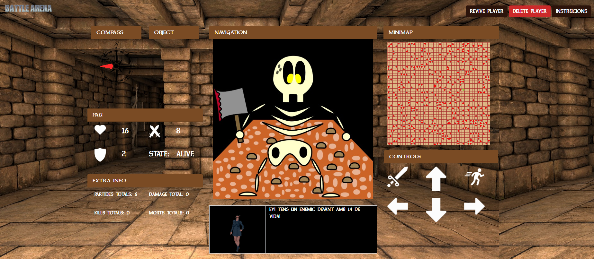
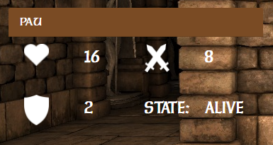
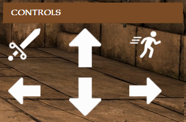

# Battle Arena Web
This is Multiplayer Battle Arena Game created for my Web Projects Class in La Salle University. It was created using Javascript, HTML, CSS and style frame framework Bootstrap        


## Player
The game uses an API to acces real time data about enemies,player info and player position. Once the data is retrieved from the API, is displayed so the user can see it in real time. For stability purposes the data is actualized every 2 seconds. 

### Player Info


- Health: float that stores the remaining health.
- Attack: float that stores the attack points of the player.
- Shield: float that stores the shield points of the player.
- State:  string that shows if the user is deead or alive. ("ALIVE" or "DEAD")

### Player Functionality


- Move Forward: Function to move the player 1 Square Forward in the map 

```javascript
    moveForward(){
        var checkPos = getFrontPos();
        if(map.getPosInfo(checkPos[0], checkPos[1]) != 100){
            movePlayer(this.token,this.d)
            .then(function (datums) {
                actualizePlayer();
                var audio = new Audio('resources/step.wav');
                audio.play();
            })
            .catch(function (err) {
                console.error('Augh, there was an error!', err.statusText);
            })
        } 
    }
```
- Move Backwards: float that stores the attack points of the player.

```javascript
    moveBackwards(){
        var posibleDir = ['N','E','S','O','N','E'];
        var checkPos = getFrontPos();
        if(map.getPosInfo(checkPos[0], checkPos[1]) != 100){
            for (let i = 0; i < posibleDir.length; i++) {
                if(posibleDir[i] == this.d){
                    movePlayer(this.token, posibleDir[i+2])
                    .then(function (datums) {
                        actualizePlayer();
                    })
                    .catch(function (err) {
                        console.error('Augh, there was an error!', err.statusText);
                    })
                    break;
                }
            }
        }
    }
```
- Rotate Left: float that stores the shield points of the player.
- Rotate Right: string that shows if the user is deead or alive. ("ALIVE" or "DEAD")
- Attack: string that shows if the user is deead or alive. ("ALIVE" or "DEAD")
- Scape: string that shows if the user is deead or alive. ("ALIVE" or "DEAD")


## Create Single 2D Texture
- name:  Name of the image
- type:  File type ('jpg','png')
```bash
$ createTexture(String name, String type)
```
